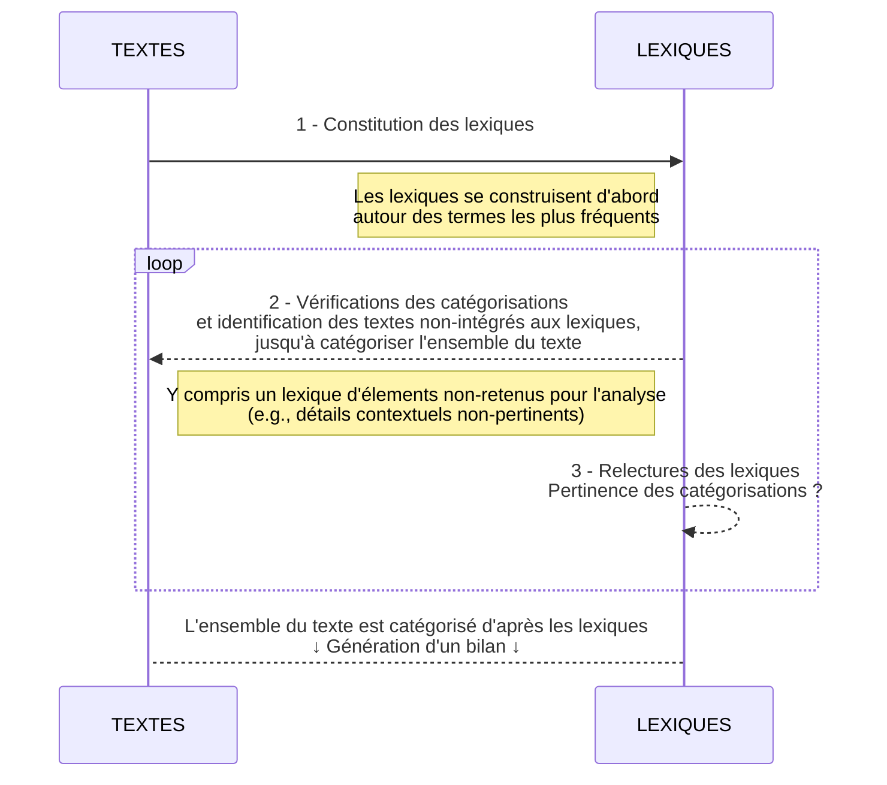

<!--Les textes sont généralement constitués de plusieurs thématiques. L'analyse thématique vise notamment à identifier ces thématiques et à caractériser la composition d'un ensemble de textes (présence ou absence des différentes thématiques).-->


Cet article résume une méthode d'analyse thématique supervisée par des lexiques. Cette méthode vise à catégoriser un ensemble 'restreints' de textes: quelques dizaines d'entretiens retranscrits, ou encore quelques centaines de textes de quelques phrases renseignés dans des questionnaires, dans les posts Facebook de vos concurrents, etc.

{}
La construction de lexiques sur-mesure permet de catégoriser les textes de façon très fiable, en garantissant que l'intégralité du texte est catégorisée. 
{}

{}
Cette méthode "manuelle" de construction de lexiques n'est pas envisageable avec de gros ensembles de textes ou des textes très longs.
{}


# Avantages de la méthode
**L'approche par lexique permet de garder trace des catégorisations réalisées, pour :**

- [x] **Relire les lexiques et vérifier les catégorisations efficacement** 
    - [x] en se concentrant seulement sur les bouts de textes pertinents,
    - [x] en ayant la possibilité d'en discuter à plusieurs,
    - [x] etc.
- [x] **Impliquer plusieurs codeurs / relecteurs efficacement**
- [x] **Produire des annexes et des détails au sujet des formulations les plus utilisées**
- [x] **Éviter les sur-interprétations, les catégorisations étant *strictement* réalisées d'après une liste de termes et de paraphrases**
- [x] **Garantir la catégorisation de l'ensemble du texte**
    - [x] en confrontant le texte "capté" dans les lexiques et le texte qu'il reste à catégoriser au fur-et-à-mesure de la construction des lexiques,
    - [x] et en terminant l'analyse avec un lexique des éléments non-pertinents (e.g., des élements contextuels sans rapport avec l'objet d'étude)
- [x] **Capitaliser chaque lexique**, voir superviser l'attribution de thématiques d'après des lexiques constitués dans de précédents projets (fonctionne surtout pour les lexiques peu hétérogènes comme les façons de désigner un véhicule par exemple)
- [x] et bien d'autres avantages...

# Constituer les lexiques
Il y a plusieurs étapes, entre la première lecture des textes et la catégorisation de l'intégralité du contenu dans des lexiques.


<figure> <figcaption> Processus de constitution de lexiques et de validation </figcaption>


<figcaption> Ce processus permet une validation par le client, des relectures croisées, etc. </figcaption>
</figure>

Au final, chaque texte est catégorisé d'après la présence ou l'absence des différentes thématiques, c'est-à-dire la présence ou l'absence de termes précis, recensés dans différents lexiques. 

<figure> <figcaption> Représentation de la catégorisation réalisée (présence ou absence des thématiques) </figcaption>

```markmap
- Corpus initial
  - TEXTE Ⅰ
    - ☑ Thème 1
      - ☑ Sous-thème 1.A
      - ☒ `Sous-thème 1.B`
    - ☑ Thème 2
    - ☒ `Thème 3`
    - ☑ Thème 4
      - ☒ `Sous-thème 4.A`
      - ☑ Sous-thème 4.B
      - ☑ Sous-thème 4.C
    - *(Thèmes 5, 6, etc.)*
  - TEXTE Ⅱ
    - ☑ Thème 1
      - ☒ `Sous-thème 1.A`
      - ☑ Sous-thème 1.B
    - ☒  `Thème 2`
    - ☑ Thème 3
    - ☑ Thème 4
      - ☒ `Sous-thème 4.A`
      - ☒ `Sous-thème 4.B`
      - ☑ Sous-thème 4.C
    - *(Thèmes 5, 6, etc.)*
  - TEXTES Ⅲ, Ⅳ, etc.
```

</figure>


Les RegEx permettent:

- de gagner du temps (e.g., en déclinant plusieurs façons d'écrire le même terme en une brève syntaxe unique);

- de superviser les caractérisations réalisées, par exemple pour distinguer les parties-prenantes (e.g., "***je*** roulais trop vite" vs. "***il*** roulait trop vite").



On peut ensuite réaliser des statistiques descriptives pour présenter les textes, typiquement en détaillant les thématiques les plus prégnantes dans les textes, celles qui coexistent entre elles - éventuellement systématiquement, etc. 

# Exemples
Cette méthode d'analyse par lexiques à été déployé pour mieux comprendre les facteurs des accidents de la route. L'analyse par lexiques concernait des textes explicatifs de situations accidentogènes et d'accidents, renseignés par des personnes impliquées dans de telles situations pendant leurs trajets en voiture, en vélo, à pied, en trottinette électrique, etc. Un exemple d'article universitaire mobilisant cette méthode est en cours de publication (**xxx à faire xxx**). Ci-ensuite, un exemple de recherche universitaire mobilisant cette méthode d'analyse par lexiques (présentation à la conférence IRTAD 2022 - [itf-oecd.org](https://www.itf-oecd.org/7th-irtad-conference-better-road-safety-data-better-safety-outcomes)). 

<embed src= "https://www.itf-oecd.org/sites/default/files/repositories/typology_of_risky_situations.pdf"  type="application/pdf" width="100%" height="600px" />

## Inconvénients de cette méthode
Le temps de constitution des lexiques augmente avec la longeur du texte qu'il faut catégoriser. Pour catégoriser un nombre important de textes, la méthode présentée dans cet article devrait "seulement" se concentrer sur un échantillon de ces textes. Pour catégoriser des ensembles importants de textes, il faut également exploiter des méthodes plus globales, non-supervisées (e.g., GloVe[^2]) ou même supervisées (e.g., fasttext[^1]). 

[^1]: https://fasttext.cc/

[^2]: https://nlp.stanford.edu/pubs/glove.pdf

